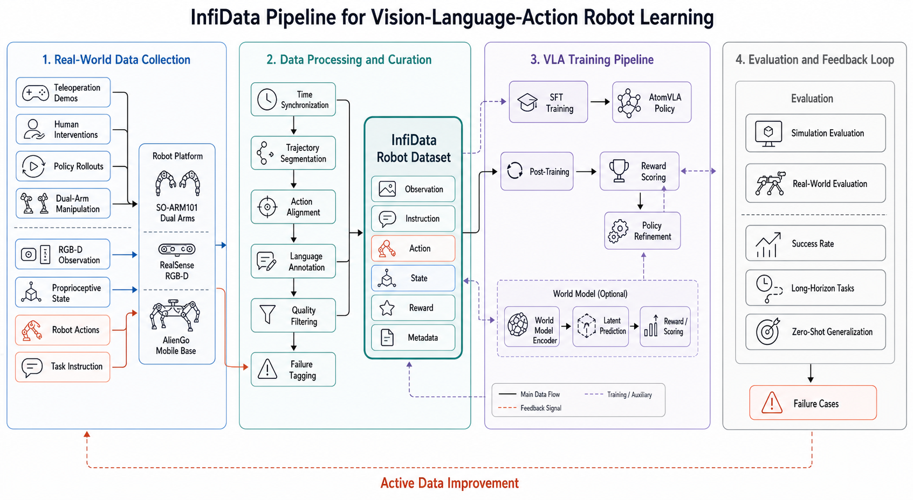

# InfiData

InfiData 是一个面向社区共建的大规模机器人操作基础模型训练数据集项目。

我们的目标不是只发布一份数据，而是联合更多实验室团队，建立一套可持续演进的 Multi-Context 数据标准，让不同机器人平台、不同采集流程、不同任务场景的数据可以稳定整合、统一标注、持续复用。

---

## 项目愿景

我们希望把分散在各团队的机器人数据，逐步沉淀为一个可共享、可追溯、可扩展的数据底座，服务机器人基础模型训练与评测。

InfiData 的长期目标：

1. 形成跨实验室可复用的数据标准和工具链。
2. 支持从模仿学习到长时序规划的训练范式。
3. 降低新团队数据接入成本，实现规模化共建。
4. 让高质量上下文标注成为默认配置，而不是附加项。

---

## 系统架构

InfiData 覆盖从真实世界数据采集、数据处理与治理，到 VLA 训练、评测和主动数据改进的完整闭环。



---

## 什么是 Multi-Context

传统机器人数据通常只包含图像、状态和动作。InfiData 在此基础上标准化了更丰富的训练上下文：

1. 任务语义：task 与 subtask。
2. 未来目标：subgoal，例如 real_future 帧指针。
3. 质量信号：quality、mistake、success。
4. 机器人上下文：robot_type、control_mode、domain。
5. 数据来源上下文：source_dataset 与相关元数据。
6. 多视角对齐：统一视频路径与帧索引规则。

这使得数据可以同时支持：

1. 动作策略学习。
2. 分层策略与子任务建模。
3. 失败恢复与鲁棒性训练。
4. 世界模型与多模态语义对齐。

---

## 当前仓库内容

```text
InfiData/
├── README.md
├── schemas/
│   ├── robot_episode.schema.json
│   ├── segment_annotation.schema.json
│   ├── human_video.schema.json
│   ├── web_multimodal.schema.json
│   └── subgoal.schema.json
├── configs/
│   ├── dataset_sources/
│   ├── robots/
│   └── tasks/
├── scripts/
│   ├── convert/
│   │   ├── convert_aloha_cosmos_mini.py
│   │   └── convert_droid_mini.py
│   ├── annotate/
│   ├── subgoals/
│   └── validate/
├── examples/
│   ├── aloha_mini/
│   └── droid_mini/
├── video2tasks/
└── tools/
```

目前仓库已经包含：

1. 两个可运行转换示例：ALOHA mini、DROID mini。
2. 统一 schema 与配置组织方式。
3. 一个可用于自动分段与指令生成的 video2tasks 模块。

---

## 详细项目说明

### 1. 数据单元定义

机器人数据以 episode 为基本单元，每个 episode 对应一个 parquet 文件，每行表示一个 timestep。

机器人 episode schema 定义在 schemas/robot_episode.schema.json。

最小必需字段：

1. episode_index
2. frame_index
3. timestamp
4. observation.state
5. action
6. task
7. subtask
8. robot_type
9. control_mode
10. quality
11. speed_bin
12. mistake
13. success
14. source_dataset

常用扩展字段：

1. observation.qvel
2. observation.effort
3. action_relative
4. video.cam_*.path 与 video.cam_*.frame_index
5. subgoal.real_future.cam_*.path 与 subgoal.real_future.cam_*.frame_index
6. domain

### 2. 子任务分段标注定义

分段标注 schema 定义在 schemas/segment_annotation.schema.json，标准存储文件是 meta/segments.jsonl。

核心字段：

1. episode_index
2. segment_index
3. start_frame
4. end_frame
5. task
6. subtask
7. annotation_status

可选字段：mistake、annotator、reviewer。

推荐标注状态流：

1. auto_placeholder
2. vlm_pseudo
3. human_labeled
4. reviewed
5. approved

### 3. 示例数据说明

examples/aloha_mini：

1. ALOHA-Cosmos-Policy 的最小转换示例。
2. 每个 episode 一个 parquet。
3. 包含 episodes、segments、tasks、robots、stats 元数据。

examples/droid_mini：

1. DROID 的最小转换示例。
2. 包含 3 个 episode parquet。
3. 包含标准相机映射和 real_future 子目标帧指针。
4. 当前 subtask 为自动占位分段，便于先打通流程。

### 4. 自动分段与 VLM 辅助

video2tasks 可用于长视频自动分段与指令草稿生成，典型流程：

1. 生成候选切分点。
2. 生成片段级任务指令。
3. 写回 segments.jsonl，状态为 vlm_pseudo。
4. 人工复核后推进到 reviewed 或 approved。

参考文档：

1. video2tasks/README.md
2. video2tasks/README_CN.md

---

## 快速开始

### 1) 环境准备

```bash
python -m venv .venv
source .venv/bin/activate
pip install -U pip
pip install numpy pandas pyarrow tqdm h5py
```

### 2) 生成 ALOHA mini 示例

```bash
python scripts/convert/convert_aloha_cosmos_mini.py \
  --aloha_root /path/to/ALOHA-Cosmos-Policy \
  --out_root examples/aloha_mini \
  --num_episodes 3
```

### 3) 生成 DROID mini 示例

```bash
python scripts/convert/convert_droid_mini.py \
  --droid_root /path/to/DROID \
  --out_root examples/droid_mini \
  --num_episodes 3
```

---

## 面向共建实验室的接入流程

如果你希望团队数据接入 InfiData，建议按以下步骤进行：

1. 对齐机器人定义：robot_type、control_mode、相机键命名。
2. 提供 mini 样本：先提交 3 到 20 个 episode 验证格式。
3. 明确字段映射：原始字段到 schema 字段逐项映射。
4. 产出转换脚本：放到 scripts/convert 并附说明。
5. 完成分段流程：自动分段、VLM 伪标、人工复核。
6. 补齐元信息：来源、许可证、标注规则、已知限制。

---

## 质量控制建议

为了保证跨团队合并训练的可用性，建议建立以下检查：

1. 结构检查：schema 合法性与字段完整性。
2. 时序检查：frame_index 连续性、segment 边界合法性。
3. 语义检查：task/subtask 命名一致性。
4. 统计检查：state/action 维度和数值分布可解释。
5. 追溯检查：source_dataset、robot_type、domain 信息完整。

---

## 项目路线图

近期：

1. 完善 scripts/validate 的自动校验能力。
2. 完善 scripts/annotate 的半自动标注流程。
3. 扩展更多公开数据源转换器。

中期：

1. 建立跨实验室数据接入模板。
2. 建立统一 benchmark 划分与版本管理。
3. 发布更完整的标注指南与审核规范。

长期：

1. 形成持续更新的大规模共建机器人数据社区。
2. 支撑机器人基础模型训练与评测的通用数据底座。

---

## 贡献与共建

欢迎高校、研究院、企业实验室、独立开发者参与共建。

优先欢迎的贡献：

1. 新数据源转换脚本。
2. 自动分段与标注优化。
3. 质量校验工具。
4. 高质量真实场景标注样例。

提交建议附带：

1. 数据来源与许可证。
2. 字段映射规则。
3. 标注状态与审核流程。
4. 已知限制与后续计划。
